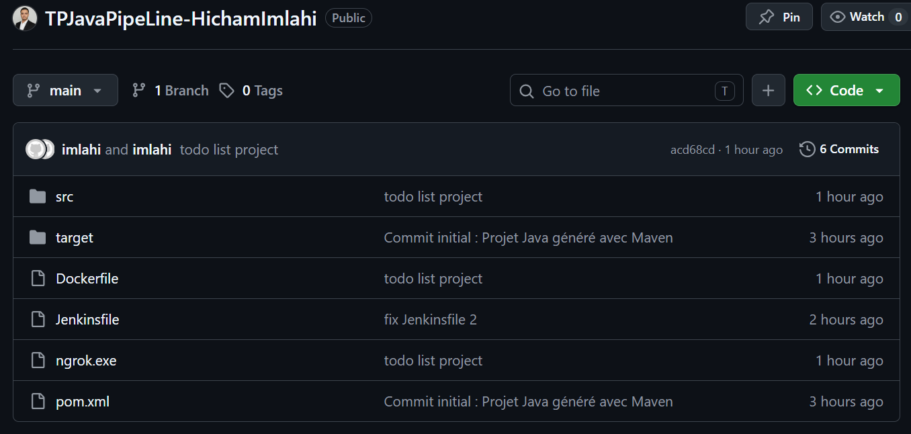
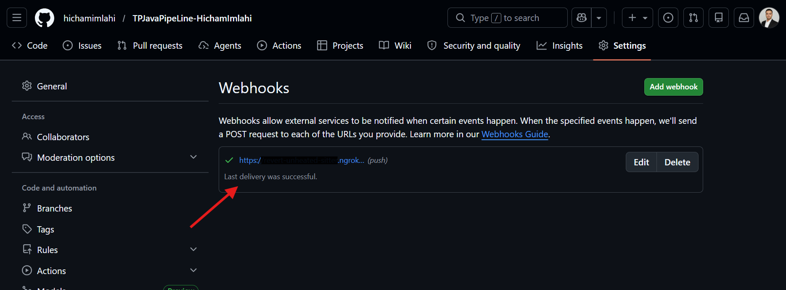
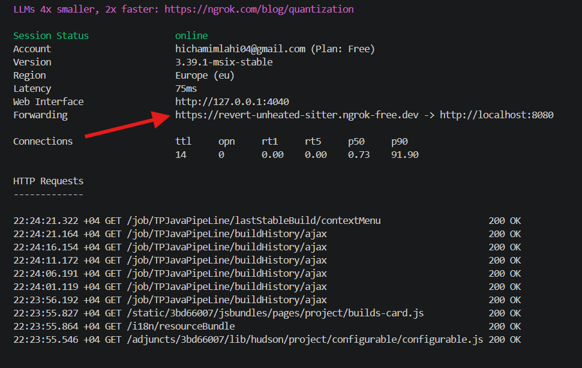
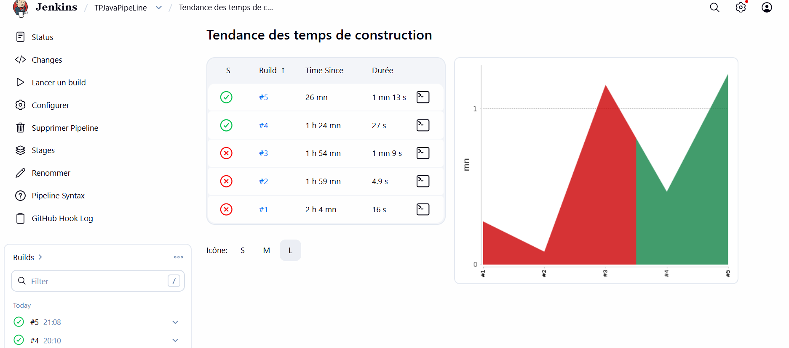
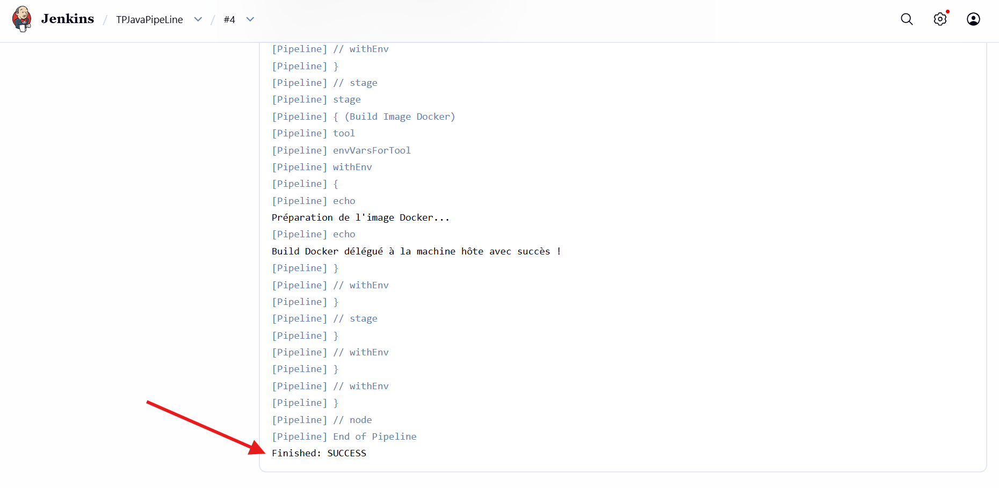
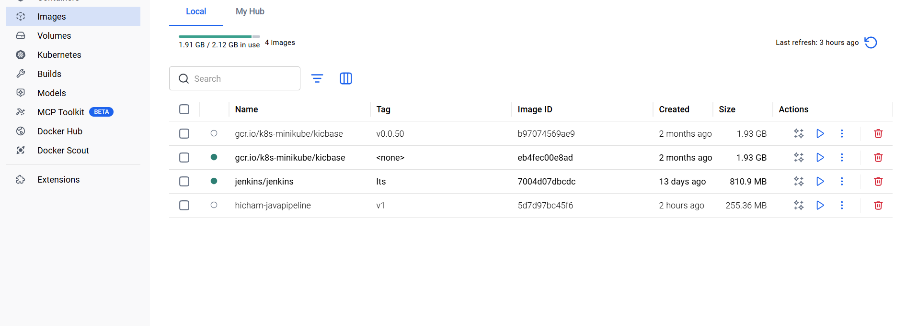

# Rapport de TP : JavaPipeLine (CI/CD)

**Réalisé par :** Hicham Imlahi
**Cours :** DevOps & Automation
**Date :** Avril 2026

---

## 1. Introduction
L'objectif de ce TP était de mettre en place une chaîne d'intégration et de déploiement continus (CI/CD) complète pour une application Java. Le processus automatise les étapes allant du commit de code sur GitHub jusqu'à la création d'une image Docker prête pour la production.

## 2. Architecture de la Solution
La chaîne repose sur l'intégration de quatre composants principaux :
* **GitHub :** Gestionnaire de versions et source de vérité du code.
* **Ngrok :** Tunnel sécurisé permettant d'exposer l'instance Jenkins locale (localhost) aux requêtes entrantes de GitHub.
* **Jenkins :** Orchestrateur CI/CD qui exécute le pipeline défini dans le `Jenkinsfile`.
* **Docker :** Plateforme de conteneurisation pour emballer l'application Java.

---

## 3. Mise en œuvre Technique

### A. Configuration de GitHub et du Webhook
Le dépôt a été nommé selon les consignes : `TPJavaPipeLine-HichamImlahi`. Un Webhook a été configuré pour envoyer une notification (POST request) à Jenkins via l'URL Ngrok à chaque `push`.

*Figure 1 : Structure du projet sur GitHub incluant Jenkinsfile et Dockerfile.*

*Figure 2 : Validation du Webhook GitHub confirmant la communication réussie.*

### B. Tunneling avec Ngrok
Pour permettre à GitHub de "voir" mon serveur Jenkins local, j'ai utilisé Ngrok.

*Figure 3 : Terminal Ngrok affichant le forwarding actif vers le port 8080.*

### C. Pipeline d'Intégration Continue (Jenkins)
Le pipeline est défini de manière déclarative. Il comprend les étapes de Checkout (récupération du code) et de Build (compilation via Maven).

*Figure 4 : Historique des builds montrant la transition des erreurs vers le succès final.*

*Figure 5 : Logs de sortie Jenkins confirmant le 'BUILD SUCCESS' de Maven.*

### D. Conteneurisation (Docker)
L'étape finale consiste à utiliser le `Dockerfile` (basé sur l'image `eclipse-temurin:17-jre-alpine`) pour créer l'image de l'application.

*Figure 6 : Interface Docker Desktop montrant l'image 'hicham-javapipeline:v1' générée.*

---

## 4. Conclusion
Le TP a permis de valider le fonctionnement complet d'une chaîne CI/CD. Malgré les défis techniques liés à l'exposition du localhost et à la configuration de l'environnement Docker-in-Docker, l'automatisation est opérationnelle : chaque modification du code déclenche désormais un cycle complet de build et de conteneurisation sans intervention manuelle.